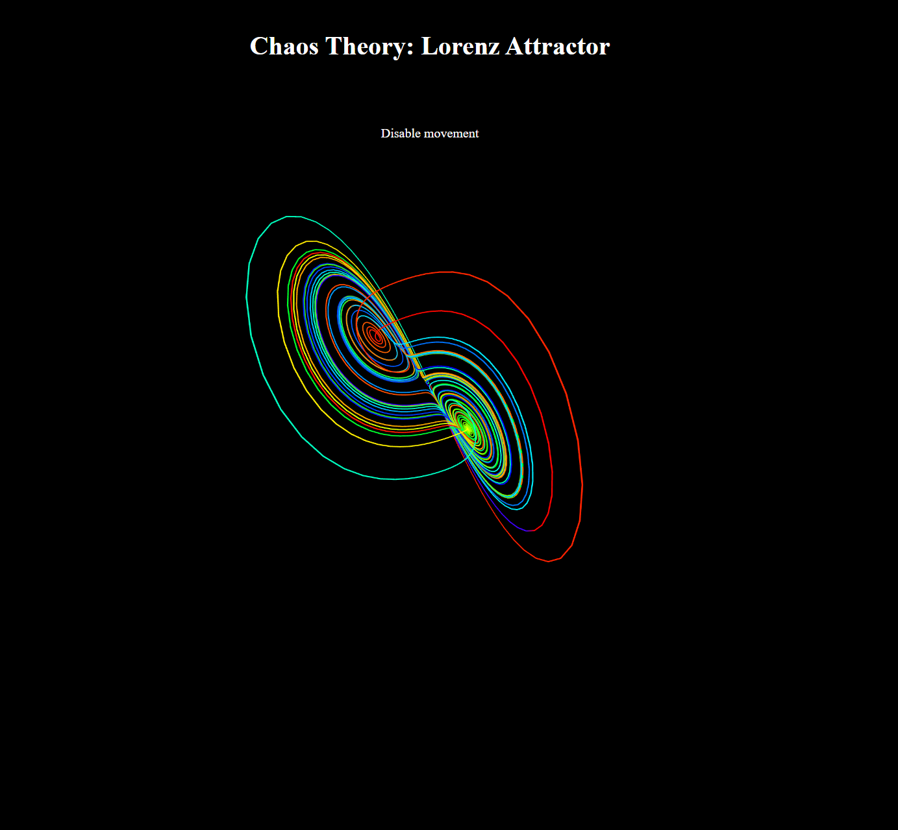

Lorenz Attractor Visualizer
=======

Author: **[Moin Khan](https://github.com/mo-inkhan)**

`Lorenz Attractor Visualizer` This project demonstrates chaos theory using the Lorenz Attractor system. It's built with [Svelte](https://svelte.dev/). The visualizer renders a 3D representation of the Lorenz Attractor, with the camera position controlled by the user's mouse.

## Demo
[Lorenz Attractor Visualizer](https://mo-inkhan.github.io/LorenzAttractorVisualizer/)

## Contributing
All contributions are welcome. Please create an issue first for any feature request or bug. Then fork the repository, create a branch and make any changes to fix the bug or add the feature and create a pull request. That's it!
Thanks!

## License
**Lorenz Attractor Visualizer** is released under the MIT License.
Check out the full license [here](LICENSE).
